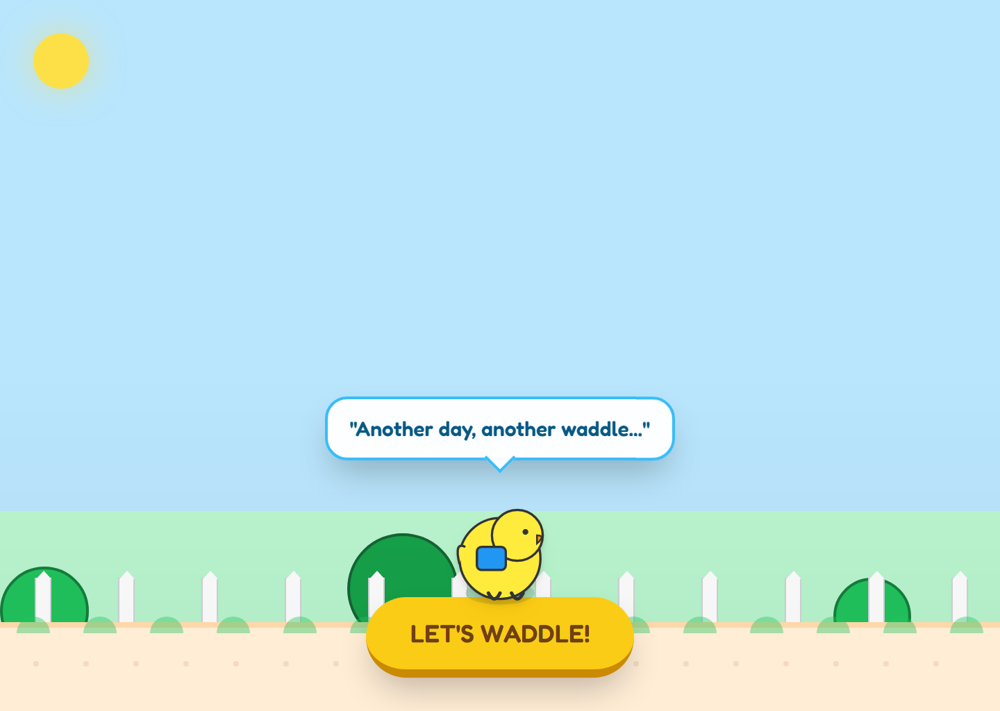
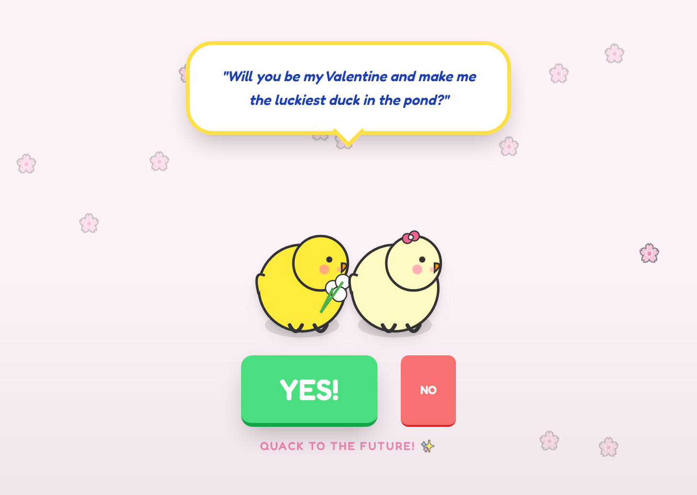
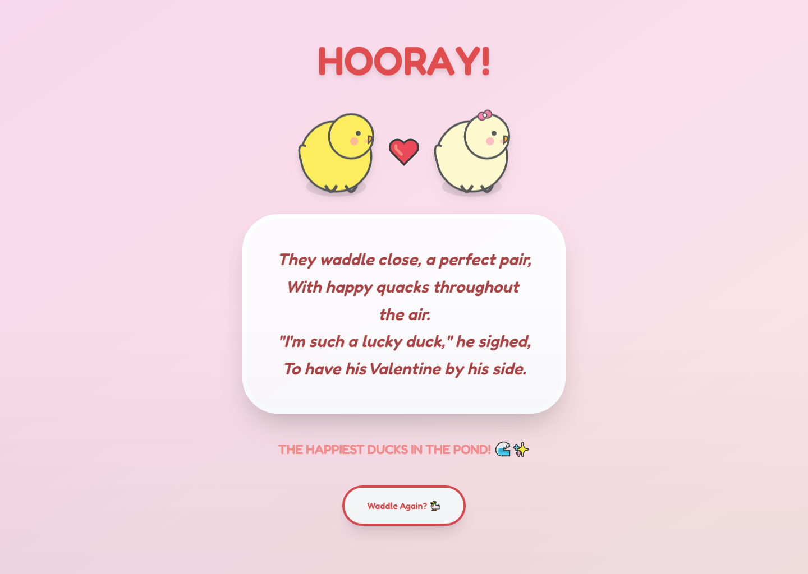

# The Lucky Ducky Valentine

## What This Is

The Lucky Ducky Valentine is an interactive Valentine built as a small scene-based web experience. Instead of a single static page, the project runs through a short duck-themed story with transitions, interaction prompts, and a finale screen.

Live demo: [bmukhiil.github.io/the-lucky-ducky-valentine](https://bmukhiil.github.io/the-lucky-ducky-valentine/)

## Preview








## What Works

- Intro scene with scrolling park journey and start interaction
- Interactive middle scenes with hearts, dialogue, and gift presentation
- Finale scene with restart flow
- Scene-to-scene transitions driven by React state
- Reusable duck character component across the full experience

## How It's Built

- React + TypeScript app bootstrapped with Vite
- Scene controller in [App.tsx](./App.tsx)
- Separate scene components under [components](./components)
- Shared character rendering through [components/Ducky.tsx](./components/Ducky.tsx)

## Technical Notes

- The repo is structured like a tiny narrative app, not just a decorative landing page. Scene progression, timing, and interaction state are the main implementation surface.
- Each scene has its own mechanic: a scrolling journey, a tap-to-pop heart sequence, a playful yes/no proposal interaction, and a restartable finale.

## Proof of Work

- Live deployment: [bmukhiil.github.io/the-lucky-ducky-valentine](https://bmukhiil.github.io/the-lucky-ducky-valentine/)
- Captured flow screenshots in [docs/assets](./docs/assets)
- Scene flow is orchestrated in [App.tsx](./App.tsx)
- Act-specific interactions live in [components/Scene1.tsx](./components/Scene1.tsx), [components/Scene2.tsx](./components/Scene2.tsx), [components/Scene3.tsx](./components/Scene3.tsx), and [components/Finale.tsx](./components/Finale.tsx)

## Run Locally

```bash
npm install
npm run dev
```
